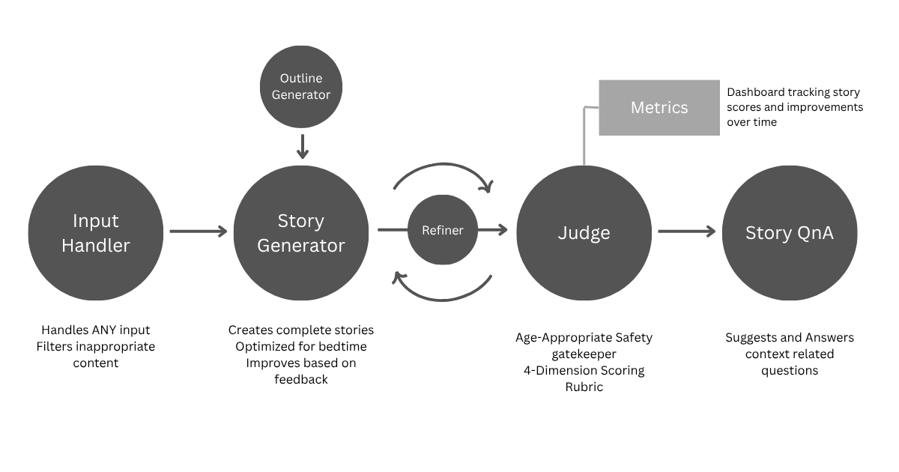
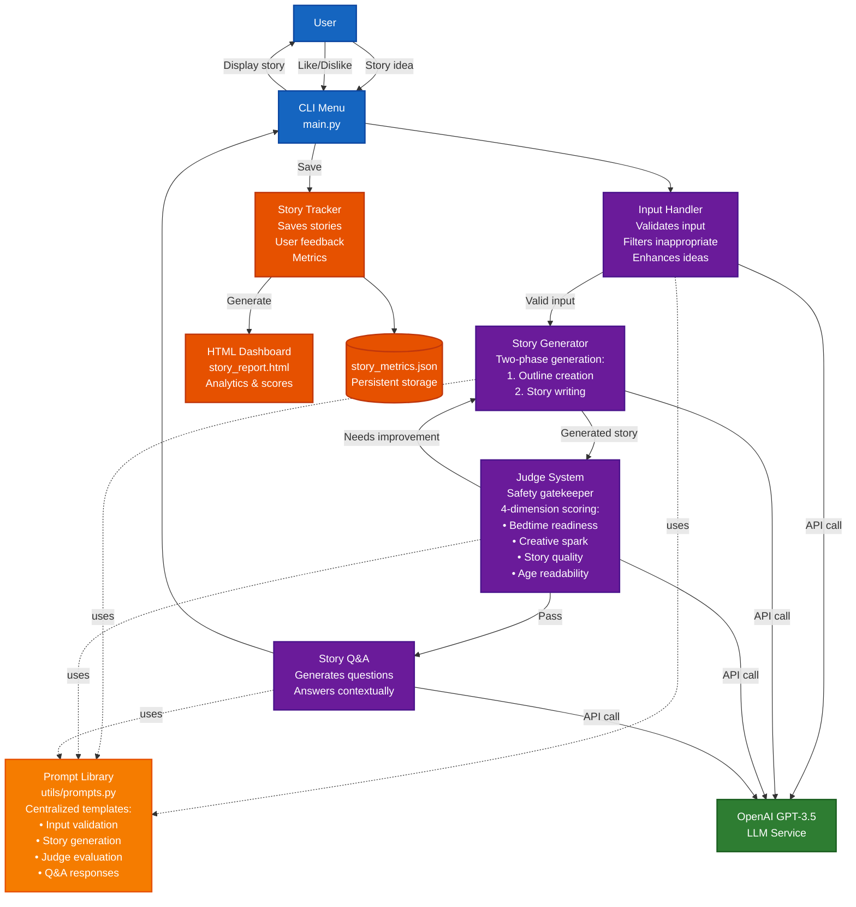

# 🌱✨ Beanstalk AI ✨🌱

**Magical Bedtime Stories for Kids 5-10**

Beanstalk AI is an intelligent bedtime story generator that creates personalized, high-quality stories for children. Each story is carefully crafted, evaluated, and refined to ensure it's perfect for bedtime.

## 🚀 Setup

### Prerequisites
- Python 3.7+
- OpenAI API key

### Installation

1. **Clone and install**
   ```bash
   git clone https://github.com/gsymmy30/beanstalk-hai.git
   cd beanstalk-hai
   pip install -r requirements.txt
   ```

2. **Set up OpenAI API key**
   
   Create a `.env` file:
   ```bash
   OPENAI_API_KEY=your_openai_api_key_here
   ```

3. **Run the app**
   ```bash
   python main.py
   ```

## 🎯 How to Use

1. Choose option `1` to create a new story
2. Enter any story idea (e.g., "dragon who loves books", "brave mouse", or even just "adventure")
3. Watch as AI creates, evaluates, and refines your story
4. Enjoy the final story and ask questions about it
5. View your story collection with option `2`

## 📖 Example Usage

```
🌱✨ BEANSTALK AI ✨🌱
Magical Bedtime Stories for Kids 5-10

  📖  1. Create a new story
  📊  2. View story report  
  🌙  3. Exit

Choose an option (1-3): 1

📖 What kind of bedtime story would you like?
Your story idea: dragon who loves books

Creating your story...
Refining the story...

📖 The Dragon Librarian

Once upon a time, in a cozy cave nestled deep...
[Full story displayed]

💫 True treasure lies in sharing stories with others.

Quality Scores
--------------------
   Character     7.5/10
   Bedtime       8.2/10
   Storytelling  7.8/10
   Age Level     7.0/10
   Overall       7.65/10

Questions you might ask:
   1. What books does the dragon like best?
   2. How do other animals feel about the dragon?
   3. What would you do if you met this dragon?

Ask a question: What books does the dragon like best?

I think the dragon loves adventure books and fairy tales! 
What kind of books would be your favorite?
```

## 🏗️ System Workflow



## 🏗️ System Architecture



### Key Components

🛡️ **Input Handler** - Handles ANY input, filters inappropriate content, provides suggestions  
✍️ **Story Generator & Refiner** - Creates complete stories, optimized for bedtime, improves based on feedback  
⚖️ **Judge** - Age-appropriate safety gatekeeper, 4-dimension scoring rubric  
🤔 **Story Q&A** - Suggests and answers context-related questions  
📊 **Metrics** - Dashboard tracking story scores and improvements over time

---

**Sweet dreams are made of stories! 🌙✨**
